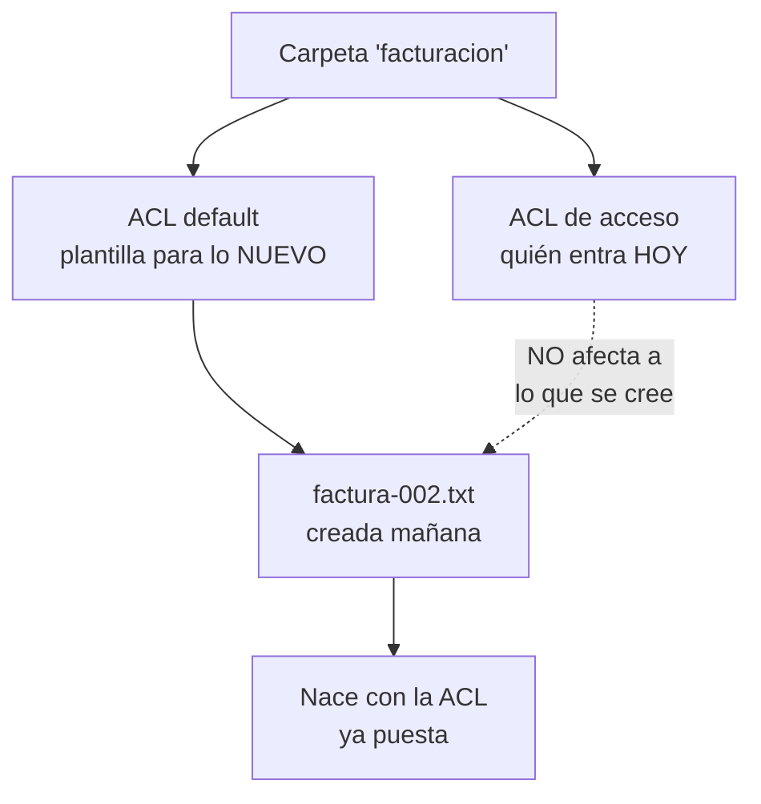
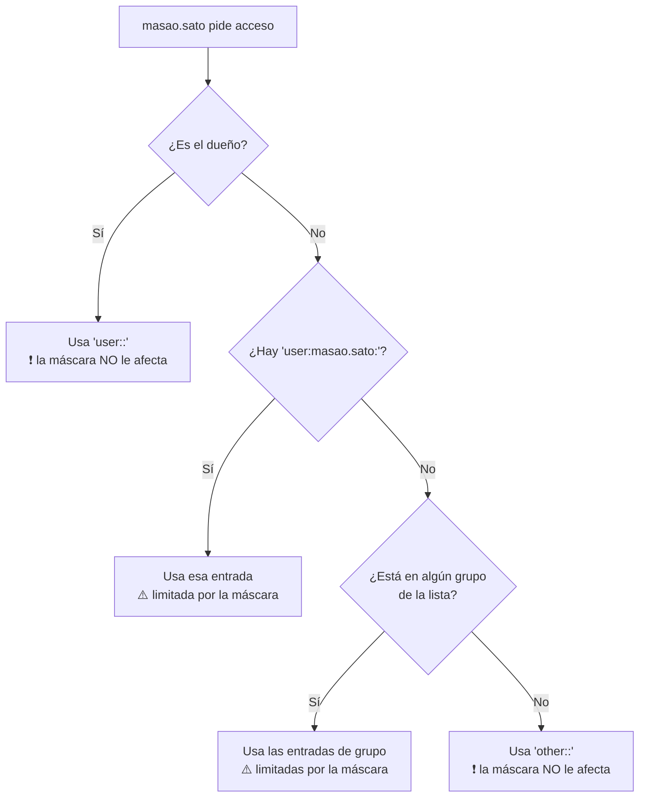

## Fase 7 · Apartado 5 — 📚 Fundamento teórico

> **[Módulo: SOR — Sistemas Operativos en Red]** · **Seguridad Avanzada (ACLs y ABE)**
> 🧭 Índice de la fase: [[Fase_7]]
>
> **📍 Cuándo se lee:** **Antes de teclear.** Y esta vez de verdad: es el apartado más denso del bloque.

---

> [!warning] 📖 Lee esto antes de tocar nada
> Las seis fases anteriores se podían hacer entendiendo el 80 % y arreglando el resto sobre la marcha. **Esta no.**
>
> Aquí vas a manejar **dos sistemas de permisos a la vez**, con una pieza —la **máscara**— que puede anular lo que acabas de escribir **sin borrarlo y sin dar ningún error**. Si no entiendes cómo funciona antes de empezar, vas a poner permisos que parecen correctos y no lo son.
>
> Son quince minutos de lectura. Te ahorran la tarde.

---

## **1 · EL PROBLEMA: los permisos de Unix no dan para esto**

Mira la carpeta de facturación de Boochan S.L. y quién necesita entrar:

| Quién | Qué necesita |
| :--- | :--- |
| **facturacion** | Leer y escribir — es su carpeta |
| **contabilidad** | Leer y escribir — corrigen y cierran las facturas |
| **comercial** | **Solo leer** — consultan si un cliente ha pagado |
| Todos los demás | **Nada.** Ni verla |

Ahora intenta expresar eso con `chmod`. Los permisos clásicos de Unix tienen **exactamente tres casillas**:

```
      dueño     grupo     otros
      rwx       rwx       rwx
```

**Un dueño. Un grupo. Y todos los demás.** Tres, y ni uno más.

> [!question] 🤔 Inténtalo antes de seguir leyendo
> Tienes tres grupos con tres niveles distintos y tres casillas. **¿Cómo lo resuelves?**
>
> - ¿Pones `facturacion` como grupo? Entonces contabilidad y comercial quedan en *"otros"*, y les tienes que dar lo mismo a los dos. Pero uno necesita escribir y el otro solo leer.
> - ¿Metes a los tres en un grupo común? Entonces comercial podría escribir facturas.
> - ¿Aflojas *"otros"*? Entonces **entra todo el mundo**, incluidos los becarios.
>
> **No se puede.** Y no es que no se te ocurra a ti: es que el modelo no da más de sí.

> [!info] 🎓 Por qué Unix se quedó corto, y por qué tardó tanto en arreglarse
> El modelo `usuario/grupo/otros` es de **1970**, pensado para máquinas donde cabían tres tipos de personas: tú, tu equipo y el resto del laboratorio. Es **simple, rapidísimo y cabe en 9 bits** dentro de cada fichero — por eso ha durado medio siglo.
>
> Pero una empresa con seis departamentos que se cruzan no es eso. Hacía falta poder decir *"este grupo sí, ese otro solo lectura, aquel nada"*, y eso necesita una **lista de longitud variable**, que ya no cabe en el hueco de siempre.
>
> La solución llegó con las **ACL**, guardadas en un sitio nuevo del sistema de ficheros: los **atributos extendidos**.

---

## **2 · QUÉ ES UNA ACL, MIRÁNDOLA POR DENTRO**

Una **ACL** *(Access Control List)* es una **lista de reglas** pegada a un fichero o carpeta. Cada línea dice *"a este, esto"*.

Así se lee una de verdad:

```bash
getfacl -p /srv/samba/departamentos/facturacion
```
```
# file: srv/samba/departamentos/facturacion
# owner: root
# group: facturacion
user::rwx                    ← el dueño (root)
group::rwx                   ← el grupo dueño (facturacion)
group:contabilidad:rwx       ← ⭐ una entrada EXTRA
group:comercial:r-x          ← ⭐ otra entrada EXTRA, con otro nivel
mask::rwx                    ← el techo (ahora lo vemos)
other::---                   ← todos los demás
default:group:comercial:r-x  ← lo que HEREDARÁ lo que se cree dentro
```

> [!tip] 💡 Las tres primeras líneas ya las conocías
> `user::`, `group::` y `other::` son **exactamente los tres campos del `chmod`**, escritos de otra forma. Una carpeta sin ACL ya tiene esas tres.
>
> **Lo nuevo son las líneas con nombre en medio:** `group:contabilidad:rwx`. Ahí es donde la lista se hace más larga que tres.

### **La anatomía de una entrada**

```
group : contabilidad : rwx
  │          │          └── qué puede hacer
  │          └── a quién  (vacío = el grupo dueño de siempre)
  └── de qué tipo: user (u), group (g), mask (m), other (o)
```

Y así se escribe:

```bash
sudo setfacl -m g:contabilidad:rwx /srv/samba/departamentos/facturacion
#             │  │      │      └── permiso
#             │  │      └── el grupo
#             │  └── g = grupo   (u = usuario, m = máscara, o = otros)
#             └── -m = modify: añade o cambia esta entrada
```

> [!warning] ⚠️ El error nº1 de esta fase: escribir la regla y no leer el resultado
> `setfacl` **casi nunca protesta**. Le pides un disparate y lo aplica. Le pides algo que la máscara va a anular, y lo aplica igual.
>
> **Después de cada `setfacl`, un `getfacl`.** Es la misma disciplina que en la Fase 6 con el `ls -ld` después del `chown`, y por el mismo motivo: *que el comando no se queje no significa que haya hecho lo que querías.*

---

## **3 · 🔴 LA MÁSCARA: lo que hace difícil esta fase**

Aquí está la pieza que se lleva por delante a todo el mundo la primera vez.

**La máscara (`mask::`) es un techo.** Ningún permiso de la lista puede superarla — **salvo dos excepciones**, y esas dos excepciones son justo las que hacen que el problema pase desapercibido.

### **A quién afecta y a quién no**

| Entrada | ¿La limita la máscara? |
| :--- | :---: |
| `user::` *(el dueño)* | ❌ **No** |
| `user:pepe:` *(un usuario con nombre)* | ✅ Sí |
| `group::` *(el grupo dueño)* | ✅ Sí |
| `group:contabilidad:` *(un grupo con nombre)* | ✅ Sí |
| `other::` *(los demás)* | ❌ **No** |

> [!danger] 🛑 Y esto es lo que la hace traicionera
> **La máscara no afecta al dueño ni a "otros".** Como tú administras con `sudo` —es decir, como `root`, que casi siempre es el dueño—, **a ti todo te funciona**.
>
> El que se queda fuera es el usuario normal. Tú pruebas, va bien, das la fase por buena. Y mañana `masao.sato` no puede entrar.

### **Cómo se ve cuando está pasando**

`getfacl` **te lo dice**, en una columna a la derecha que casi nadie mira:

```
group:comercial:r-x		#effective:r--
                 │                    │
                 │                    └── lo que REALMENTE se aplica
                 └── lo que pone la lista
```

**Pone `r-x` y significa `r--`.** El permiso está escrito, es correcto, y **no funciona**. El `mask::r--` lo ha recortado.

```bash
# Ver si hay algo recortado en todas las carpetas de golpe:
getfacl -p /srv/samba/departamentos/* | grep "#effective"
```
**Si eso no devuelve nada, no hay máscaras recortando.** Es el `grep` más rentable de la fase.

### **Por qué se descoloca la máscara sola**

No hace falta tocarla a mano para romperla:

| Qué haces | Qué le pasa a la máscara |
| :--- | :--- |
| `setfacl -m g:X:rwx` | Se **recalcula** para dar cabida al permiso nuevo |
| **`chmod g-w carpeta`** | 💥 **Se cambia la máscara, no el grupo dueño** |
| `chmod 770 carpeta` | 💥 Idem: el dígito del medio va a la máscara |

> [!danger] 🛑 Cuando hay ACL, `chmod` deja de significar lo que creías
> En una carpeta **con ACL**, el dígito central de `chmod` **ya no toca al grupo dueño: toca a la máscara.** Y al tocar la máscara, recorta **a todos los grupos y usuarios de la lista a la vez**.
>
> Un `chmod 750` inocente puede dejar sin escritura a tres departamentos de golpe, sin borrar ni una entrada.
>
> **Regla:** carpeta con ACL, se gestiona **con `setfacl`**. Si necesitas subir el techo:
> ```bash
> sudo setfacl -m m::rwx /srv/samba/departamentos/facturacion
> ```

> [!question] 🤔 ¿Y para qué sirve entonces la máscara, si solo da problemas?
> Para **cerrar de golpe**. Bajar la máscara a `r--` deja toda la carpeta en solo lectura **para todos los grupos de la lista**, sin tocar ni una entrada — y se revierte subiéndola otra vez.
>
> Es un interruptor general. Útil el día que tienes que cortar el acceso a algo **ya**, y peligrosísimo si no sabes que existe.

---

## **4 · LAS DOS LISTAS: la de ahora y la del futuro**

Cada carpeta tiene **dos ACL independientes**:

| Lista | Qué hace | Cómo se escribe |
| :--- | :--- | :--- |
| **De acceso** | Quién entra **en la carpeta, ahora** | `setfacl -m …` |
| **Por defecto** *(default)* | Qué heredará **lo que se cree dentro** | `setfacl -d -m …` |



> [!danger] 🛑 Poner una sin la otra es el fallo que se nota tarde
> - **Solo acceso, sin `-d`:** funciona con lo que hay hoy. Lo que se cree mañana **nace sin permisos**. La carpeta se va degradando sola durante semanas.
> - **Solo `-d`, sin acceso:** lo nuevo sale bien y **lo que ya estaba dentro es inaccesible**.
>
> Por eso en el procedimiento **cada permiso se pone dos veces**. No es redundancia: son dos cosas distintas.

> [!info] 🎓 Esto ya lo has visto con otro nombre
> El **setgid** de la Fase 6 hacía lo mismo para **el grupo** de los ficheros nuevos. La ACL por defecto lo hace para **la lista entera**.
>
> Son dos mecanismos de herencia distintos, y **en tu servidor están funcionando los dos a la vez**: el setgid decide el grupo, la ACL default decide la lista. Ninguno sustituye al otro.

---

## **5 · CÓMO DECIDE EL SISTEMA, PASO A PASO**

Cuando `masao.sato` intenta abrir un fichero, el núcleo no mira toda la lista: **recorre un orden y se para en la primera coincidencia.**



**Tres consecuencias prácticas que conviene tener claras:**

1. **Una entrada de usuario gana a la de su grupo.** Si `user:masao.sato:---` existe, da igual que `comercial` tenga `rwx`: se para antes.
2. **Cuentan todos sus grupos, no solo el primario.** Por eso en la Fase 5 no importaba que el `gid=` fuera `100(users)`: lo que se mira es la **pertenencia**, y ahí sí está `comercial`.
3. **`root` se salta casi todo.** Por eso probar con `sudo` no demuestra nada:
   ```bash
   sudo -u 'BOOCHANLAB\masao.sato' ls /srv/samba/departamentos/facturacion
   ```
   **Prueba siempre como el usuario que va a sufrir el permiso**, no como administrador.

---

## **6 · LA SEGUNDA CAPA: denegar no es lo mismo que ocultar**

Todo lo anterior decide **quién entra**. Falta la otra mitad de la fase.

Imagina a `shinnosuke.nohara`, el becario, abriendo `\\UbuntuServer` desde Windows. Las ACL están perfectas: no puede entrar en ningún sitio. Pero **ve la lista**:

```
facturacion    contabilidad    comercial
logistica      rrhh            becarios       comun
```

No puede abrir nada. Y ya sabe: que existe un departamento de RRHH, que hay una carpeta de contabilidad, y **a quién pedirle acceso** o a quién intentar suplantar.

> [!danger] 🛑 Un nombre de carpeta es información
> En una empresa real esa lista diría `nominas`, `expedientes`, `despidos_2026`, `auditoria_fiscal`. **Sin abrir nada, ya sabes de qué va la empresa y dónde está lo que importa.**
>
> La primera fase de cualquier intrusión —y de casi todo abuso interno— es **enumerar**: ver qué hay. Ocultar la lista no es cosmético: es quitarle el mapa a quien no debería tenerlo.

**Eso es ABE** *(Access Based Enumeration)*: Samba **filtra el listado** según quién pregunta. Cada usuario ve **su** lista, no la lista.

| Opción de `smb.conf` | Qué oculta |
| :--- | :--- |
| `access based share enum = yes` | El **recurso entero** en el listado del servidor |
| `hide unreadable = yes` | Los **ficheros y carpetas de dentro** que no puede leer |

> [!warning] ⚠️ ABE no protege: solo oculta
> Un recurso oculto **sigue ahí**, y quien sepa el nombre puede intentar `\\servidor\rrhh` directamente. **Lo que le para es la ACL, no el ABE.**
>
> Son dos capas y hacen falta las dos:
> - **ACL sin ABE** → seguro, pero regalas el mapa.
> - **ABE sin ACL** → escondido, y el que mire dentro entra. **Eso es seguridad por oscuridad, y no es seguridad.**

> [!info] 🎓 Y aquí está la trampa pedagógica de esta fase
> **El ABE no se puede comprobar desde el servidor.** Ocurre en el listado de red que ve un cliente Windows.
>
> Desde Ubuntu, una carpeta bien protegida y una protegida a medias **se comportan exactamente igual**. Por eso el apartado 8.a te dejará **cuatro pruebas anotadas para la Fase 8** en lugar de dar la fase por cerrada.
>
> **Hay configuraciones que no se pueden verificar desde donde se escriben.** Aceptar eso —y dejarlo apuntado en vez de suponer— es de las cosas más profesionales que vas a hacer en el módulo.

---

## **7 · LA TERCERA PIEZA: que Windows no machaque tus permisos**

Windows y Linux **no tienen el mismo modelo de permisos**. Windows usa sus propias ACL, con más tipos de permiso y otra forma de heredar.

Cuando un usuario copia un fichero desde Windows a tu carpeta, alguien tiene que traducir. De eso se encarga:

```ini
vfs objects = acl_xattr
```

**Guarda los permisos de Windows como atributos extendidos** dentro del sistema de ficheros de Linux, junto a las ACL POSIX. Sin ese módulo, cada sistema escribe los suyos y **el último que pasa gana** — normalmente machacando lo que configuraste.

> [!info] 🎓 Es el mismo patrón que ya conoces
> En la **Fase 5**, `winbind` traducía **identidades** entre los dos mundos. Aquí `acl_xattr` traduce **permisos**.
>
> Hacer convivir Windows y Linux es, en el fondo, **una colección de traductores**. Cada vez que dos sistemas distintos tienen que entenderse, hay una pieza en medio haciendo ese trabajo — y cuando falta, no da un error claro: simplemente las cosas dejan de cuadrar.

---

## 📖 **Vocabulario de la fase** *(seis palabras, ni una más)*

| Término | Qué es |
| :--- | :--- |
| **ACL** | Lista de reglas de acceso pegada a un fichero, más allá de dueño/grupo/otros |
| **Máscara** (`mask::`) | Techo que limita a los grupos y usuarios **con nombre**. No afecta al dueño ni a *otros* |
| **`#effective`** | La columna de `getfacl` que dice **lo que se aplica de verdad** cuando la máscara recorta |
| **ACL por defecto** (`-d`) | Plantilla que heredará **lo que se cree dentro** de la carpeta |
| **ABE** | Que cada usuario vea **su** lista de carpetas, no la lista completa |
| **`acl_xattr`** | El traductor que evita que Windows machaque las ACL de Linux |

---

> [!question] 🤔 Comprueba que lo has entendido *(antes de teclear nada)*
> 1. Con los permisos clásicos de Unix, **¿por qué es imposible** dar `rwx` a facturación, `rwx` a contabilidad y `r-x` a comercial sobre la misma carpeta?
> 2. Un compañero te enseña esto y dice *"el permiso está puesto y no funciona"*:
>    ```
>    group:comercial:r-x		#effective:r--
>    ```
>    **¿Qué le contestas en diez segundos?**
> 3. **¿Por qué probar un permiso con `sudo` no demuestra nada?**
> 4. Pones `setfacl -m g:X:rwx` pero olvidas el `-d`. ¿Qué funcionará hoy y qué fallará dentro de un mes?
> 5. Un servidor tiene las ACL perfectas y **no** tiene ABE. **¿Es inseguro?** Justifica el sí o el no.
> 6. Y al revés: tiene ABE y las ACL mal. **¿Es seguro?**
>
> **Las respuestas van en tu entrada de apuntes**, con tus palabras.

---

### 🔓 Red Solo Anfitrión de VirtualBox

> [!info] ℹ️ Sin cambios de red en esta fase
> Esta fase trabaja íntegramente dentro del servidor — permisos de ficheros, ACL y configuración de Samba. No requiere tocar el adaptador de red ni el firewall: todo lo necesario para el acceso desde Windows (SMB 445, Kerberos, LDAP…) ya está activo desde la Fase 4 sobre la Red Solo Anfitrión `10.10.10.0/24`.

---

> [!summary] 🎓 Lo que tienes que llevarte antes de teclear
> Que **el modelo de permisos de Unix se queda corto** en cuanto hay más de un grupo implicado, y que las ACL existen exactamente para eso.
>
> Que **la máscara es un techo que no afecta al dueño** — y que por eso, administrando con `sudo`, no la ves nunca hasta que un usuario se queja.
>
> Que **hay dos listas**: la de ahora y la de lo que se cree después. Poner una sin la otra es un fallo que tarda semanas en aparecer.
>
> Que **denegar el acceso y ocultar la existencia son dos capas distintas**, y que hacen falta las dos: una sin otra deja el trabajo a medias, de dos formas diferentes.
>
> Y la que más te va a costar aceptar: **`setfacl` no te va a avisar de casi nada.** Aplica lo que le pidas, aunque sea absurdo, y deja que la máscara anule lo que acabas de escribir sin decir palabra. **La verificación no es un trámite de esta fase: es la única forma de saber lo que has hecho.**
>
> **Siguiente:** [[Fase_7.6_Procedimiento]] — a aplicar la matriz.

---

| ← Anterior | 🧭 Índice | Siguiente → |
| :--- | :---: | ---: |
| [[Fase_7.4_Donde_Estamos]] | [[Fase_7]] | [[Fase_7.6_Procedimiento]] |
